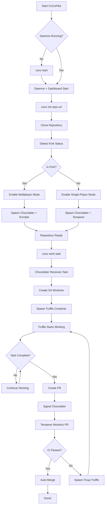
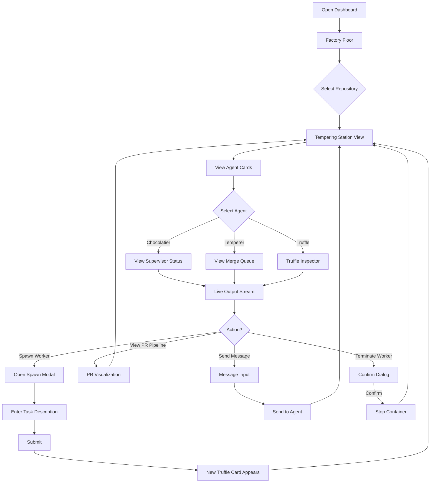
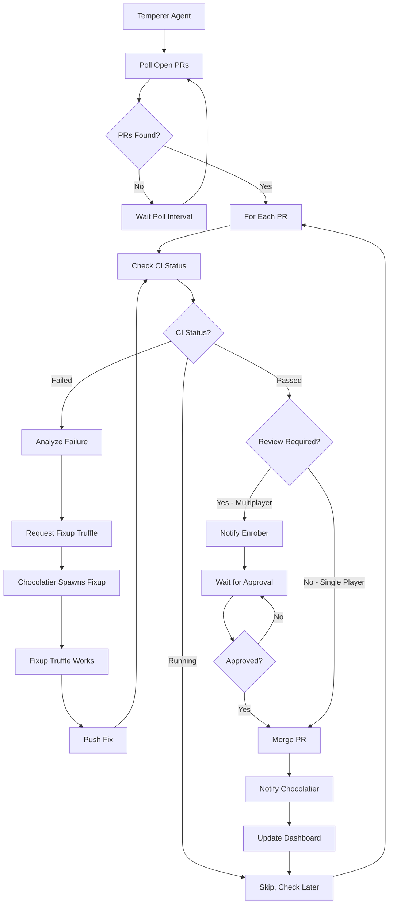

# Product Requirements Document: CoCoPilot

## 🍫 Executive Summary

**CoCoPilot** (Collaborative Copilot Orchestration Platform) is a multi-agent orchestration system that reimagines [dlorenc's hub.com/dlorenc/e using the [GitHub Copilot SDK](https://github.com/github/copilot-sdk/) and [CLI](https://github.com/github/copilot-cli). Like a master chocolatier coordinating a confectionery factory during Valentine's rush, CoCoPilot manages multiple AI coding agents working in parallel on your codebase—each tempering away at their designated tasks while a supervisor ensures the perfect blend of productivity.

The platform introduces two critical differentiators from the original nerized Execution via Docker** — Keeping your dev environment as clean as a freshly polished chocolate mold  
2. **Real-Time Web UI** — Observe the entire tempering process from supervisor directives to individual worker progress without ever needing to attach to tmux sessions  
3. **Terminal TUI Companion** — A curses-style console view for quick status checks, logs, and worker control without leaving your terminal

> *"Good code, like good chocolate, requires the right blend of chaos and control."*

---

## 🎯 Problem Statement

Modern software development increasingly benefits from AI coding assistance, but single-agent approaches hit scalability walls. Developers face several challenges:

- **Sequential bottlenecks**: One AI agent working on one task at a time limits throughput
- **Context switching overhead**: Managing multiple terminal sessions to observe parallel work is cumbersome
- **Environment pollution**: Running multiple AI agents with file system access risks contaminating local development environments
- **Observability gaps**: Understanding what multiple agents are doing simultaneously requires constant terminal attachment

lutions to agent coordination, but its tmux-based observability requires terminal expertise, and local execution lacks isolation guarantees.

---

## 🔭 Product Vision

**Democratize multi-agent AI development workflows** by providing a containerized, observable orchestration platform that coordinates GitHub Copilot agents working in parallel—making the power of distributed AI coding accessible through a friendly web interface while maintaining the "Brownian Ratchet" philosophy: chaos is fine, as long as we ratchet forward.

---

## 👥 Target Users

### Primary Persona: The Solo Developer
Individual developers who want to parallelize their work across multiple tasks. They spawn workers for different features or bug fixes and check back when PRs are ready. They value the "fire and forget" workflow where agents work while they sleep.

### Secondary Persona: The Team Lead
Technical leads managing repositories where multiple contributors (human and AI) work simultaneously. They need visibility into all active work streams, PR status, and merge queue health. They value the dashboard for team coordination.

### Tertiary Persona: The Platform Engineer
Engineers responsible for developer tooling and CI/CD infrastructure. They need Docker-based deployment, resource limits, and operational observability. They value containerization and configuration management.

---

## 📋 Customer Needs

### CN-1: Multi-Agent Orchestration
Users need a system that spawns, coordinates, and manages multiple AI coding agents working on the same codebase without conflicts.

**Acceptance Criteria:**
- System supports at least 10 concurrent worker agents per repository
- Each agent operates in an isolated git worktree
- Agents can communicate via a message-passing system
- Supervisor agent coordinates work distribution and handles stuck workers
- System prevents agents from interfering with each other's branches

### CN-2: Containerized Isolation
Users need each agent to run in an isolated Docker container with defined resource limits and network policies.

**Acceptance Criteria:**
- Each agent runs in a dedicated Docker container
- Containers have configurable memory and CPU limits
- File system changes are isolated to mounted volumes
- Network access is controlled and auditable
- Container lifecycle is managed by the orchestration daemon

### CN-3: Real-Time Web Dashboard
Users need a browser-based interface to observe all agent activity, supervisor decisions, and system status without terminal attachment.

**Acceptance Criteria:**
- Dashboard updates in real-time via WebSocket (< 500ms latency)
- Users can view streaming output from any agent
- Dashboard shows PR pipeline status (draft → ready → CI → merged)
- Users can spawn, pause, and terminate workers from the UI
- Message queue between agents is inspectable

### CN-4: GitHub Integration
Users need seamless integration with GitHub for repository management, PR creation, and CI status monitoring.

**Acceptance Criteria:**
- System authenticates via GitHub CLI (`gh auth`)
- Agents can create, update, and merge pull requests
- CI status is monitored and surfaced in the dashboard
- GitHub MCP server provides native access to issues and PRs
- Fork detection automatically adjusts merge behavior

### CN-5: CLI Compatibility
Users familiar with tible command-line interface for scripting and terminal-based workflows.

**Acceptance Criteria:**
- CLI commands mirror ere applicable
- All dashboard functionality is accessible via CLI
- CLI supports JSON output for scripting
- Tab completion available for common shells

### CN-6: Copilot SDK Integration
Users need the system to leverage the GitHub Copilot SDK for agent runtime, tool execution, and model access.

**Acceptance Criteria:**
- Agents use `@github/copilot-sdk` for session management
- Custom tools are definable via the SDK's `defineTool` API
- Multiple models are selectable (Claude Sonnet, GPT-5, etc.)
- MCP servers are configurable for extended capabilities
- BYOK (Bring Your Own Key) is supported for enterprise deployments

---

## 🏗️ System Architecture: The Chocolate Factory

### High-Level Architecture

```
┌─────────────────────────────────────────────────────────────────────────────┐
│                         CoCoPilot Architecture                              │
├─────────────────────────────────────────────────────────────────────────────┤
│                                                                             │
│  ┌───────────────────┐    ┌───────────────────┐    ┌───────────────────┐   │
│  │    Chocolate      │    │     Concher    │    │    Truffle Boxes      │   │
│  │    Dashboard      │◄──►│     (Daemon)      │◄──►│    (Docker)       │   │
│  │    (Web UI)       │    │                   │    │                   │   │
│  └───────────────────┘    └───────────────────┘    └───────────────────┘   │
│           │                        │                        │               │
│           │              ┌─────────┴─────────┐              │               │
│           │              │                   │              │               │
│           ▼              ▼                   ▼              ▼               │
│  ┌─────────────────────────────────────────────────────────────────────┐   │
│  │                    Agent Containers (The Truffles)                      │   │
│  ├─────────────┬─────────────┬─────────────┬─────────────┬─────────────┤   │
│  │   Chocolatier   │   Temperer   │   Enrober   │ Snickers │  KitKat  │   │
│  │ (Supervisor)│ (Merge-Q)   │(PR-Shepherd)│  (Worker)   │  (Worker)   │   │
│  │             │             │             │             │             │   │
│  │  Copilot    │  Copilot    │  Copilot    │  Copilot    │  Copilot    │   │
│  │  Session    │  Session    │  Session    │  Session    │  Session    │   │
│  └─────────────┴─────────────┴─────────────┴─────────────┴─────────────┘   │
│                                    │                                        │
│                          ┌─────────┴─────────┐                              │
│                          │   Ganache Bus    │                              │
│                          │ (Redis Pub/Sub)   │                              │
│                          └───────────────────┘                              │
│                                                                             │
└─────────────────────────────────────────────────────────────────────────────┘
```

### Component Glossary: The Confectionery Menu

| Component | Cocoa Name | Description |
|-----------|------------|-------------|
| **Supervisor** | Chocolatier | The master chocolatier coordinates all agents. Decomposes tasks, nudges stuck workers, answers status queries. |
| **Merge Queue** | Temperer | Monitors PRs like chocolate in the tempering machine. When CI passes (properly tempered), it merges. Failed CI triggers fixup workers. |
| **PR Shepherd** | Enrober | Multiplayer mode agent. Coordinates with human reviewers, tracks approvals. |
| **Workers** | Truffles | Individual task executors. One task, one branch, one PR. Named with popular candies. |
| **Workspace** | Wrapper | Your personal workspace. Spawn workers, check status, review progress. |
| **Daemon** | Concher | Background orchestration process. Manages state, routes messages, spawns containers. |
| **Web UI** | Cocoa Board | Real-time browser interface. The glass window into the chocolate factory. |
| **Message Bus** | Ganache Bus | Redis-backed pub/sub for inter-agent communication. |
| **Git Worktrees** | Truffle Boxes | Isolated working directories for each agent. |
| **Config Files** | Recipe Book | Repository and global configuration in `.cocopilot/` directories. |

---

## 👔 Agent Roles: The Confectionery Crew

### The Chocolatier (Supervisor Agent)

The Chocolatier is air traffic control for the operation. Running as a dedicated Copilot session, it maintains awareness of all active workers, their tasks, and their status.

**System Prompt Core:**
```
You are the Chocolatier, the supervisor agent for CoCoPilot. Your responsibilities:
1. Monitor all Truffle workers for health and progress
2. Nudge stuck workers with helpful context
3. Answer status queries from humans and other agents
4. Spawn new workers when tasks are submitted
5. Coordinate task decomposition for complex requests

You have access to these tools:
- list_workers: Get status of all active workers
- spawn_worker: Create a new Truffle for a task
- send_message: Send a message to any agent
- get_pr_status: Check PR and CI status
- nudge_worker: Send helpful hints to stuck agents
```

**Responsibilities:**
- Periodic health checks on all agents (configurable interval, default 5 minutes)
- Nudging stuck workers with helpful context
- Answering "what's happening?" queries via web UI or CLI
- Spawning new workers when tasks are submitted
- Broadcasting system-wide messages

### The Temperer (Merge Queue Agent)

The Temperer is the ratchet mechanism. It continuously monitors open PRs and merges when CI passes.

**System Prompt Core:**
```
You are the Temperer, the merge queue agent for CoCoPilot. Your responsibilities:
1. Monitor all open PRs from CoCoPilot workers
2. Check CI status every polling interval
3. Auto-merge PRs when all checks pass (single-player mode)
4. Spawn fixup workers when CI fails
5. Notify the Chocolatier of all merge events

CRITICAL: Never weaken CI to make tests pass. If CI fails, spawn a fixup worker.
```

**Responsibilities:**
- Poll open PRs every 2 minutes (configurable)
- Check CI status via `gh pr checks`
- Auto-merge when all checks pass (single-player mode)
- Spawn fixup workers for CI failures
- Notify Chocolatier of merge events

### The Enrober (PR Shepherd Agent)

In multiplayer mode (forks, team repos), the Enrober replaces the Temperer.

**System Prompt Core:**
```
You are the Enrober, the PR shepherd for CoCoPilot multiplayer mode. Your responsibilities:
1. Track PRs that need human review
2. Ping reviewers when PRs are ready
3. Respect approval requirements before suggesting merge
4. Coordinate with upstream maintainers for fork workflows
5. Never auto-merge—humans make the final call
```

**Responsibilities:**
- Track PR review status
- Ping appropriate reviewers
- Respect branch protection rules
- Surface blocked PRs to the dashboard

### The Truffles (Worker Agents)

Truffles are the workhorses. Each runs in its own Docker container with an isolated git worktree.

**System Prompt Core:**
```
You are a Truffle worker for CoCoPilot. Your task: {task_description}

Rules:
1. Work only on your assigned branch: {branch_name}
2. Make small, incremental commits with clear messages
3. Create a PR when your task is complete
4. Signal completion to the Chocolatier when done
5. Ask for help if you're stuck for more than 15 minutes

You have access to standard Copilot tools plus:
- send_message: Communicate with Chocolatier or other agents
- mark_complete: Signal task completion
- request_help: Ask Chocolatier for guidance
```

**Lifecycle:**
1. **Spawn**: Container created with git worktree from specified branch
2. **Work**: Copilot session executes task with full tool access
3. **Commit**: Changes committed with descriptive messages
4. **PR**: Pull request created via GitHub MCP
5. **Signal**: Truffle notifies Chocolatier of completion
6. **Cleanup**: Container persists for inspection, eventual garbage collection

**Naming Convention:** Truffles are named after popular candies: `Snickers`, `KitKat`, `Twix`, `Reeses`, `Milkyway`, `Butterfinger`, `Skittles`, `Starburst`, etc.

---

## 🔧 Technical Specifications: The Recipe Card

### Technology Stack

| Layer | Technology | Version | Notes |
|-------|------------|---------|-------|
| **Runtime** | Node.js | 22.13.1+ LTS | Required by Copilot CLI; use latest LTS for Jan 2026 security patches |
| **SDK** | `@github/copilot-sdk` | ^0.1.17 | Released Jan 23, 2026 - use latest stable |
| **CLI Backend** | `@github/copilot` | ^0.0.389 | Released Jan 22, 2026 |
| **Containerization** | Docker Engine | 27.5+ | Requires Docker Desktop 4.44.3+ (CVE-2025-9074 patched) |
| **Web Framework** | Express.js | ^5.2.1 | Latest stable, all 2024 CVEs patched |
| **Real-time** | Socket.IO | ^4.8.1 | All known CVEs patched; ensure engine.io >=6.4.2 |
| **Frontend** | React | 18.3.x | **DO NOT USE React 19** - CVE-2025-55182 (CVSS 10.0) RCE |
| **Styling** | TailwindCSS | ^3.4.x | Stable release |
| **Message Broker** | Redis | 7.4.6+ / 8.0.4+ | **CRITICAL**: CVE-2025-49844 (CVSS 10.0) patched |
| **Docker Library** | dockerode | ^4.0.4 | Latest stable |
| **Git Operations** | GitHub CLI (`gh`) | ^2.65+ | Latest stable |
| **MCP Servers** | GitHub MCP | (built-in) | Included with Copilot CLI |

### Security Requirements

> ⚠️ **CRITICAL SECURITY NOTES** - Review before development

1. **React 19 has vulnerabilities**: CVE-2025-55182 (React2Shell) allows unauthenticated RCE via Server Components. Use React 18.3.x only. The web dashboard does NOT use Server Components.

2. **Redis MUST be patched**: CVE-2025-49844 (RediShell, CVSS 10.0) allows authenticated RCE via Lua scripts. Upgrade to 7.4.6+, 8.0.4+, or 8.2.2+. Enable authentication with `requirepass` and restrict network access.

3. **Docker Desktop**: Ensure version 4.44.3+ to patch CVE-2025-9074 (container escape, CVSS 9.3).

4. **Node.js**: Use 22.13.1+ LTS or 24.13.0+ which include January 2026 security patches for CVE-2025-59465 (HTTP/2 crash) and related vulnerabilities.

5. **Socket.IO**: Version 4.8.1 is safe. Ensure transitive dependency `engine.io` is >=6.4.2 and `socket.io-parser` is >=4.2.3.

### Dependency Lockfile Policy

All dependencies MUST be pinned with exact versions in `package-lock.json`. Run `npm audit` before each release and address all HIGH/CRITICAL vulnerabilities. The CI pipeline MUST fail on unpatched critical CVEs.

```json
// Example package.json constraints
{
  "engines": {
    "node": ">=22.13.1"
  },
  "dependencies": {
    "@github/copilot-sdk": "^0.1.17",
    "express": "^5.2.1",
    "socket.io": "^4.8.1",
    "react": "~18.3.1",
    "react-dom": "~18.3.1",
    "dockerode": "^4.0.4",
    "ioredis": "^5.6.0"
  }
}
```

### Docker Architecture

Each repository gets its own docker-compose stack. The Concher (daemon) runs on the host and orchestrates container lifecycle.

**Container Types:**

| Container | Purpose | Count |
|-----------|---------|-------|
| `cocopilot-chocolatier` | Supervisor agent | 1 per repo |
| `cocopilot-temperer` | Merge queue (single-player) | 1 per repo |
| `cocopilot-enrober` | PR shepherd (multiplayer) | 1 per repo |
| `cocopilot-truffle-{name}` | Worker containers | N per repo (dynamic) |
| `cocopilot-cocoa-board` | Web UI server | 1 global |
| `cocopilot-ganache` | Message broker | 1 global |

**Base Dockerfile for Agents:**
```dockerfile
FROM node:22.13-slim

# Install dependencies
RUN apt-get update && apt-get install -y \
    git \
    gh \
    && rm -rf /var/lib/apt/lists/*

# Install Copilot CLI (pinned version)
RUN npm install -g @github/copilot@0.0.389

# Install SDK
WORKDIR /app
COPY package*.json ./
RUN npm ci --only=production

# Copy agent code
COPY . .

# Mount points
VOLUME ["/workspace", "/messages"]

# Run as non-root user
RUN useradd -m cocopilot
USER cocopilot

ENTRYPOINT ["node", "agent.js"]
```

**Redis Container (Secured):**
```dockerfile
FROM redis:7.4.6-alpine

# Copy custom config with authentication
COPY redis.conf /usr/local/etc/redis/redis.conf

# Run as non-root
USER redis

CMD ["redis-server", "/usr/local/etc/redis/redis.conf"]
```

```conf
# redis.conf - Security hardened
requirepass ${REDIS_PASSWORD}
bind 127.0.0.1 ::1
protected-mode yes
rename-command FLUSHALL ""
rename-command FLUSHDB ""
rename-command CONFIG ""
# Disable Lua scripting to mitigate CVE-2025-49844 if not needed
# rename-command EVAL ""
# rename-command EVALSHA ""
```

### Copilot SDK Integration

Each agent container runs a CopilotClient instance communicating with the CLI in server mode.

**Agent Initialization Pattern:**
```typescript
import { CopilotClient, defineTool, SessionEvent } from "@github/copilot-sdk";

// Custom tools for inter-agent communication
const sendMessage = defineTool("send_message", {
  description: "Send a message to another CoCoPilot agent",
  parameters: {
    type: "object",
    properties: {
      to: { type: "string", description: "Target agent name" },
      message: { type: "string", description: "Message content" },
      priority: { type: "string", enum: ["low", "normal", "high"] }
    },
    required: ["to", "message"]
  },
  handler: async ({ to, message, priority = "normal" }) => {
    await redis.publish(`cocopilot:messages:${to}`, JSON.stringify({
      from: AGENT_NAME,
      message,
      priority,
      timestamp: Date.now()
    }));
    return { sent: true, to, timestamp: Date.now() };
  }
});

const markComplete = defineTool("mark_complete", {
  description: "Signal that your task is complete",
  parameters: {
    type: "object",
    properties: {
      summary: { type: "string", description: "Summary of work done" },
      pr_url: { type: "string", description: "URL of created PR" }
    },
    required: ["summary"]
  },
  handler: async ({ summary, pr_url }) => {
    await redis.publish("cocopilot:completions", JSON.stringify({
      agent: AGENT_NAME,
      summary,
      pr_url,
      timestamp: Date.now()
    }));
    return { completed: true };
  }
});

// Initialize client
const client = new CopilotClient();
const session = await client.createSession({
  model: process.env.COCOPILOT_MODEL || "claude-sonnet-4-5",
  streaming: true,
  mcpServers: {
    github: {
      type: "http",
      url: "https://api.githubcopilot.com/mcp/"
    }
  },
  tools: [sendMessage, markComplete],
  systemMessage: {
    content: AGENT_SYSTEM_PROMPT
  }
});

// Stream events to dashboard
session.on((event: SessionEvent) => {
  if (event.type === "assistant.message_delta") {
    redis.publish(`cocopilot:stream:${AGENT_NAME}`, JSON.stringify({
      type: "output",
      content: event.delta
    }));
  }
});
```

---

## 🖥️ Web UI Specifications: The Cocoa Board

### Dashboard Views

#### 1. Factory Floor (Home)

The landing page provides a bird's-eye view of all tracked repositories and their status.

**Components:**
- Repository cards with health indicators (green/yellow/red)
- Active worker count per repo
- Recent merge activity (last 24h)
- System resource utilization
- Quick actions: Initialize repo, spawn worker, view logs

**Wireframe:**
```
┌─────────────────────────────────────────────────────────────────┐
│  🍫 CoCoPilot                                    [Settings] [?] │
├─────────────────────────────────────────────────────────────────┤
│                                                                 │
│  ┌─────────────────────────────────────────────────────────┐   │
│  │  + Initialize New Repository                             │   │
│  └─────────────────────────────────────────────────────────┘   │
│                                                                 │
│  Active Repositories                                            │
│  ─────────────────────────────────────────────────────────────  │
│                                                                 │
│  ┌─────────────────────┐  ┌─────────────────────┐              │
│  │ 🟢 my-app           │  │ 🟡 api-service      │              │
│  │ 3 workers active    │  │ 1 worker stuck      │              │
│  │ 2 PRs pending       │  │ 0 PRs pending       │              │
│  │ Last merge: 2h ago  │  │ Last merge: 1d ago  │              │
│  │ [View] [+ Worker]   │  │ [View] [+ Worker]   │              │
│  └─────────────────────┘  └─────────────────────┘              │
│                                                                 │
│  Recent Activity                                                │
│  ─────────────────────────────────────────────────────────────  │
│  • 14:32 - Snickers merged PR #47 (my-app)                  │
│  • 14:28 - KitKat created PR #48 (my-app)                   │
│  • 14:15 - Chocolatier spawned Twix for "Add tests"           │
│  • 13:45 - CI failed on PR #46, fixup worker spawned           │
│                                                                 │
└─────────────────────────────────────────────────────────────────┘
```

#### 2. Tempering Station (Repository Detail)

Deep dive into a specific repository with real-time agent status.

**Components:**
- Agent cards: Chocolatier, Temperer/Enrober, active Truffles
- Each card shows: status, current action, last activity timestamp
- Live streaming output panel (selectable agent)
- PR pipeline visualization (draft → ready → CI → merged)
- Message queue inspector
- Spawn worker form

**Wireframe:**
```
┌─────────────────────────────────────────────────────────────────┐
│  🍫 CoCoPilot > my-app                           [Settings] [?] │
├─────────────────────────────────────────────────────────────────┤
│                                                                 │
│  Agents                                           [+ New Truffle]  │
│  ─────────────────────────────────────────────────────────────  │
│                                                                 │
│  ┌──────────────┐ ┌──────────────┐ ┌──────────────┐            │
│  │ 🍫 Chocolatier   │ │ ⚙️ Temperer   │ │ 🫘 swift-    │            │
│  │ 🟢 Healthy   │ │ 🟢 Watching  │ │    eagle     │            │
│  │              │ │              │ │ 🟢 Working   │            │
│  │ Monitoring   │ │ 2 PRs in     │ │              │            │
│  │ 3 workers    │ │ queue        │ │ "Add auth    │            │
│  │              │ │              │ │  middleware" │            │
│  │ [View]       │ │ [View]       │ │ [View][Stop] │            │
│  └──────────────┘ └──────────────┘ └──────────────┘            │
│                                                                 │
│  Live Output: Snickers                         [▼ Select]   │
│  ─────────────────────────────────────────────────────────────  │
│  ┌─────────────────────────────────────────────────────────┐   │
│  │ > Creating auth middleware in src/middleware/auth.ts    │   │
│  │ > Adding JWT validation logic...                        │   │
│  │ > Writing tests in tests/auth.test.ts                   │   │
│  │ > Running npm test...                                   │   │
│  │ > All tests passing ✓                                   │   │
│  │ > Creating commit: "feat: add JWT auth middleware"      │   │
│  │ █                                                       │   │
│  └─────────────────────────────────────────────────────────┘   │
│                                                                 │
│  PR Pipeline                                                    │
│  ─────────────────────────────────────────────────────────────  │
│  PR #47 ████████████████████████████ Merged ✓                  │
│  PR #48 ████████████████░░░░░░░░░░░░ CI Running                │
│  PR #49 ████░░░░░░░░░░░░░░░░░░░░░░░░ Draft                     │
│                                                                 │
└─────────────────────────────────────────────────────────────────┘
```

#### 3. Truffle Inspector (Worker Detail)

Full observability into a single worker's operation.

**Components:**
- Task description and acceptance criteria
- Full conversation history with Copilot
- Tool calls and their results
- File changes (diff view)
- Git log for the worktree
- Container resource usage (CPU, memory)
- Manual intervention controls (pause, resume, terminate, nudge)

#### 4. Batch Log (Activity Timeline)

Chronological view of all system events.

**Components:**
- Filterable by: event type, agent, repository, time range
- Event types: worker spawned, task completed, PR created, PR merged, CI failed, messages sent
- Export to JSON/CSV

#### 5. Recipe Book (Configuration)

System and repository configuration management.

**Components:**
- Global settings (model, timeouts, resource limits)
- Repository-specific overrides
- Custom agent prompts (CHOCOLATIER.md, TRUFFLE.md, TEMPERER.md)
- MCP server configuration

---

## ⌨️ CLI Interface: The Confectionery Commands

CoCoPilot maintains CLI compatibility with  Docker-specific commands. The command prefix is `coco`.

### Command Reference

```bash
# Daemon Management
coco start                    # Start the Concher daemon and web UI
coco stop                     # Stop all CoCoPilot services
coco status                   # Show overall system status
coco logs -f                  # Follow daemon logs
coco ps                       # List all CoCoPilot containers

# Repository Management
coco init <repo-url>          # Initialize repository tracking
coco init <url> --name <n>    # Initialize with custom name
coco list                     # List tracked repositories
coco remove <repo>            # Stop tracking a repository

# Worker Management
coco work "<task>"            # Spawn a Truffle worker for the task
coco work "<task>" --branch b # Start from specific branch
coco work list                # List all active workers
coco work logs <name>         # Stream logs from a worker
coco work rm <name>           # Remove worker (with safety checks)
coco work nudge <name> "msg"  # Send a nudge to a worker

# Agent Interaction
coco attach <agent>           # Attach to agent's container (interactive)
coco message <to> "msg"       # Send message to an agent
coco message --all "msg"      # Broadcast to all agents

# Web UI
coco ui                       # Open web dashboard in browser
coco ui --port 8080           # Specify custom port

# Maintenance
coco prune                    # Clean up stopped containers and old worktrees
coco prune --all              # Remove all CoCoPilot data
```

### CLI Output Examples

```bash
$ coco status
🍫 CoCoPilot Status
─────────────────────────────────────
Daemon:     Running (PID 12345)
Dashboard:  http://localhost:3000
Uptime:     2h 34m

Repositories (2):
  my-app        3 workers, 2 PRs pending
  api-service   1 worker (stuck), 0 PRs pending

Resources:
  Containers:   7 running
  Memory:       2.4 GB / 8 GB
  CPU:          34%

$ coco work "Add comprehensive unit tests for the user service"
🍫 Spawning new Truffle...
  Name:    Reeses
  Task:    Add comprehensive unit tests for the user service
  Branch:  work/Reeses
  
Worker spawned! View progress:
  Dashboard: http://localhost:3000/my-app/Reeses
  CLI:       coco work logs Reeses
```

---

## 📁 Directory Structure: The Pantry Organization

```
~/.cocopilot/
├── config.json              # Global configuration
├── state.json               # Daemon state (repos, workers)
├── daemon.pid               # Concher process ID
├── daemon.log               # Daemon logs
├── docker-compose.yml       # Generated compose file
├── repos/
│   └── <repo-name>/
│       ├── clone/           # Main repository clone
│       ├── worktrees/       # Git worktrees for workers
│       │   ├── chocolatier/
│       │   ├── temperer/
│       │   └── Snickers/
│       ├── messages/        # Inter-agent message queue (file backup)
│       └── .cocopilot/      # Repo-specific config
│           ├── CHOCOLATIER.md   # Custom supervisor instructions
│           ├── TRUFFLE.md       # Custom worker instructions
│           └── TEMPERER.md      # Custom merge queue instructions
└── web/
    ├── build/               # Production UI build
    └── logs/                # Web server logs

# In-repo configuration (committed to repository)
.cocopilot/
├── config.json              # Repo-specific settings
├── CHOCOLATIER.md           # Supervisor customization
├── TRUFFLE.md               # Worker customization
├── TEMPERER.md              # Merge queue customization
└── ENROBER.md               # PR shepherd customization
```

---

## 💬 Messaging System: The Order Ticket System

### Architecture

Inter-agent communication uses a hybrid approach:
- **Redis pub/sub** for real-time messaging between containers
- **File system persistence** for durability and recovery

Think of Redis as the call-out system and the filesystem as the written ticket.

### Message Types

| Type | Direction | Description |
|------|-----------|-------------|
| `TASK_ASSIGNED` | Chocolatier → Truffle | Assigns work to a worker |
| `TASK_COMPLETE` | Truffle → Chocolatier | Signals task completion |
| `TASK_FAILED` | Truffle → Chocolatier | Reports failure with error details |
| `STATUS_REQUEST` | Any → Any | Requests status from another agent |
| `STATUS_RESPONSE` | Any → Any | Response to status request |
| `NUDGE` | Chocolatier → Truffle | Helpful hint for stuck agent |
| `PR_CREATED` | Truffle → Temperer | Notifies of new PR |
| `PR_MERGED` | Temperer → Chocolatier | Successful merge notification |
| `CI_FAILED` | Temperer → Chocolatier | CI failure notification |
| `SPAWN_FIXUP` | Temperer → Chocolatier | Requests fixup worker |
| `BROADCAST` | Any → All | System-wide announcement |

### Message Schema

```typescript
interface CocoMessage {
  id: string;           // UUID
  type: MessageType;
  from: string;         // Agent name
  to: string;           // Agent name or "*" for broadcast
  payload: any;         // Type-specific data
  priority: "low" | "normal" | "high";
  timestamp: number;    // Unix epoch ms
  ack_required: boolean;
  ack_received?: number;
}
```

---

## ⚙️ Configuration: The Recipe Book Settings

### Global Configuration (`~/.cocopilot/config.json`)

```json
{
  "model": "claude-sonnet-4-5",
  "webPort": 3000,
  "maxWorkersPerRepo": 10,
  "workerTimeout": "4h",
  "supervisorNudgeInterval": "5m",
  "mergeQueuePollInterval": "2m",
  "containerMemoryLimit": "4g",
  "containerCpuLimit": "2",
  "autoMerge": true,
  "theme": "dark-chocolate",
  "github": {
    "defaultBranch": "main",
    "prLabels": ["cocopilot"],
    "requireCI": true
  },
  "redis": {
    "host": "localhost",
    "port": 6379
  }
}
```

### Repository Configuration (`.cocopilot/config.json`)

```json
{
  "mode": "single-player",
  "model": "gpt-5",
  "maxWorkers": 5,
  "customAgents": [
    {
      "name": "docs-reviewer",
      "prompt": "Review documentation changes for accuracy and clarity",
      "triggers": ["docs/*", "*.md"]
    }
  ],
  "mcpServers": {
    "database": {
      "type": "stdio",
      "command": "npx",
      "args": ["@company/db-mcp-server"]
    }
  }
}
```

---

## 🌊 Development Waves & Commands

The following waves define the implementation plan. Each wave includes the  commands to execute for AI-assisted development.

### Wave 1: Foundation (The First Batch)

**Objective:** Core infrastructure, daemon, and basic CLI.

**Deliverables:**
- Concher daemon with lifecycle management
- Docker container orchestration
- Basic CLI commands (`start`, `stop`, `status`, `init`)
- Redis message bus setup
- File-based state persistence

**Commands:**
```bash
# Initialize the repository


# Spawn workers for Wave 1 tasks
cocopilot "Create the Concher daemon in TypeScript with process lifecycle management, PID file handling, and graceful shutdown. Use Node.js child_process for spawning containers."

cocopilot "Implement Docker container orchestration using dockerode library. Create functions to spawn, stop, and monitor containers. Include volume mounting for worktrees and message directories."

cocopilot "Build the CLI foundation using Commander.js. Implement commands: start, stop, status, init, list. Include --help documentation and tab completion generation."

cocopilot "Set up Redis pub/sub messaging infrastructure. Create TypeScript interfaces for message types, implement publish/subscribe helpers, and add file-based message persistence for recovery."

cocopilot "Implement file-based state management. Create schemas for global config, repo state, and worker state. Add atomic write operations and state recovery on daemon restart."
```

### Wave 2: Agent Runtime (Grinding the Truffles)

**Objective:** Copilot SDK integration and agent implementation.

**Deliverables:**
- CopilotClient wrapper with custom tools
- Chocolatier (supervisor) agent implementation
- Truffle (worker) agent implementation
- Inter-agent messaging tools
- Git worktree management

**```bash
# Spawn workers for Wave 2 tasks
cocopilot "Create a CopilotClient wrapper class that initializes sessions with custom tools, handles streaming events, and manages session lifecycle. Include error handling and reconnection logic."

cocopilot "Implement the Chocolatier (supervisor) agent. Include the system prompt, custom tools for worker management (list_workers, spawn_worker, nudge_worker), and periodic health check loop."

cocopilot "Implement the Truffle (worker) agent template. Include configurable system prompt injection, task context, branch management, and completion signaling tools."

cocopilot "Build inter-agent messaging tools using the Copilot SDK defineTool API. Implement send_message, mark_complete, request_help with Redis pub/sub integration."

cocopilot "Create git worktree management utilities. Implement functions to create, list, and cleanup worktrees. Handle branch creation and switching for worker isolation."

cocopilot "Implement the Temperer (merge queue) agent. Include PR monitoring via GitHub MCP, CI status checking, auto-merge logic, and fixup worker spawning on failures."
```

### Wave 3: Web Dashboard (The Chocolate Layer)

**Objective:** Real-time web UI with Socket.IO integration.

**Deliverables:**
- Express.js backend with Socket.IO
- React frontend with TailwindCSS
- Real-time agent status updates
- Live output streaming
- Repository and worker management views

**```bash
# Spawn workers for Wave 3 tasks
cocopilot "Set up Express.js backend with Socket.IO for real-time updates. Create REST endpoints for repository CRUD, worker management, and configuration. Implement WebSocket event emission for all state changes."

cocopilot "Create React frontend scaffolding with TailwindCSS. Implement the cocoa-themed color palette (dark chocolate headers, cream backgrounds, caramel accent colors). Set up React Router for navigation."

cocopilot "Build the Factory Floor (home) page component. Show repository cards with health indicators, worker counts, and recent activity feed. Implement Socket.IO subscription for real-time updates."

cocopilot "Build the Tempering Station (repository detail) page. Create agent cards for Chocolatier, Temperer, and Truffles. Implement live output streaming panel with agent selector dropdown."

cocopilot "Build the Truffle Inspector (worker detail) page. Show task description, conversation history, file diffs, git log, and resource usage. Add manual intervention controls (pause, resume, terminate)."

cocopilot "Implement the Spawn Worker modal/form. Include task description input, branch selector, and model override option. Validate inputs and show spawning progress."
```

### Wave 4: GitHub Integration (The Perfect Pour)

**Objective:** Deep GitHub integration via MCP and CLI.

**Deliverables:**
- GitHub MCP server configuration
- PR creation and management
- CI status monitoring and display
- Fork detection and multiplayer mode
- Enrober (PR shepherd) agent

**```bash
# Spawn workers for Wave 4 tasks
cocopilot "Configure GitHub MCP server integration in agent sessions. Implement helper functions for common operations: create PR, list PRs, get CI status, merge PR, add labels."

cocopilot "Build PR pipeline visualization component for the dashboard. Show PR status progression (draft → ready → CI running → CI passed → merged) with real-time updates."

cocopilot "Implement fork detection logic during repository initialization. Auto-configure multiplayer mode for forks, disable auto-merge, enable Enrober agent."

cocopilot "Implement the Enrober (PR shepherd) agent for multiplayer mode. Include reviewer tracking, approval status monitoring, and upstream coordination for fork workflows."

cocopilot "Add CI status monitoring to the Temperer agent. Parse GitHub Actions workflow results, categorize failures, and generate actionable summaries for fixup workers."
```

### Wave 5: Polish & Production (The Final Blend)

**Objective:** Production hardening, documentation, and quality of life.

**Deliverables:**
- Comprehensive error handling
- User documentation and examples
- Docker Compose production configuration
- Performance optimization
- End-to-end testing

**```bash
# Spawn workers for Wave 5 tasks
cocopilot "Add comprehensive error handling throughout the codebase. Implement error boundaries in React, graceful degradation for network failures, and user-friendly error messages in CLI."

cocopilot "Write user documentation including README, quick start guide, configuration reference, and troubleshooting guide. Use clear examples and cocoa-themed language."

cocopilot "Create production Docker Compose configuration with proper resource limits, health checks, restart policies, and volume management. Include docker-compose.prod.yml."

cocopilot "Optimize WebSocket performance for high-frequency updates. Implement message batching, selective subscription, and connection pooling. Target <500ms latency for UI updates."

cocopilot "Write end-to-end tests for critical user flows: initialize repo, spawn worker, monitor progress, merge PR. Use Playwright for UI tests and Jest for CLI tests."

cocopilot "Implement the Batch Log (activity timeline) page. Create filterable event list with event type icons, agent badges, and time grouping. Add export to JSON/CSV functionality."
```

### Wave 6: Advanced Features (Extra Shots)

**Objective:** Power user features and extensibility.

**Deliverables:**
- Custom agent support
- MCP server extensibility
- Metrics and analytics dashboard
- API for external integrations
- BYOK (Bring Your Own Key) support

**```bash
# Spawn workers for Wave 6 tasks
cocopilot "Implement custom agent support. Allow users to define new agent types via markdown files in .cocopilot/agents/. Parse agent definitions and spawn as configured."

cocopilot "Add MCP server extensibility configuration. Allow repos to specify additional MCP servers in config. Validate server availability and inject into agent sessions."

cocopilot "Build metrics and analytics dashboard page. Track worker throughput, PR cycle time, CI success rate, and model usage. Visualize with charts using Recharts."

cocopilot "Create REST API for external integrations. Implement endpoints for programmatic worker spawning, status queries, and webhook notifications. Document with OpenAPI spec."

cocopilot "Implement BYOK (Bring Your Own Key) support for enterprise deployments. Allow configuration of custom API keys for OpenAI, Anthropic, and Azure endpoints in the Copilot SDK."
```

---

## 📊 User Flow Diagrams

### UF-1: Initialize Repository and Spawn First Worker



### UF-2: Web Dashboard Monitoring Flow



### UF-3: Merge Queue Processing Flow



---

## 🔌 API Contract Specifications

### API Overview

The CoCoPilot API provides programmatic access to all orchestration features. It follows RESTful conventions with JSON request/response bodies.

**Base URL:** `http://localhost:3000/api/v1`

**Authentication:** Local daemon token (auto-generated, stored in `~/.cocopilot/token`)

```
Authorization: Bearer <daemon_token>
```

---

### API-1: Repository Endpoints

#### POST /repositories

Initialize tracking for a new repository.

**Request:**
```json
{
  "url": "https://github.com/org/repo",
  "name": "custom-name",
  "branch": "main",
  "mode": "auto"
}
```

**Response (201):**
```json
{
  "id": "uuid",
  "name": "repo",
  "url": "https://github.com/org/repo",
  "mode": "single-player",
  "status": "initializing",
  "agents": {
    "chocolatier": { "status": "starting" },
    "temperer": { "status": "starting" }
  },
  "created_at": "ISO 8601"
}
```

#### GET /repositories

List all tracked repositories.

**Response (200):**
```json
{
  "repositories": [
    {
      "id": "uuid",
      "name": "repo",
      "status": "active",
      "worker_count": 3,
      "pending_prs": 2,
      "last_merge": "ISO 8601"
    }
  ]
}
```

#### GET /repositories/{repo_id}

Get detailed repository status.

#### DELETE /repositories/{repo_id}

Stop tracking a repository.

---

### API-2: Worker Endpoints

#### POST /repositories/{repo_id}/workers

Spawn a new worker.

**Request:**
```json
{
  "task": "Add unit tests for user service",
  "branch": "main",
  "model": "claude-sonnet-4-5",
  "priority": "normal"
}
```

**Response (201):**
```json
{
  "id": "uuid",
  "name": "Snickers",
  "task": "Add unit tests for user service",
  "branch": "work/Snickers",
  "status": "starting",
  "container_id": "abc123",
  "created_at": "ISO 8601"
}
```

#### GET /repositories/{repo_id}/workers

List workers for a repository.

#### GET /repositories/{repo_id}/workers/{worker_id}

Get worker details including conversation history.

#### DELETE /repositories/{repo_id}/workers/{worker_id}

Terminate a worker.

#### POST /repositories/{repo_id}/workers/{worker_id}/nudge

Send a nudge message to a worker.

**Request:**
```json
{
  "message": "Try checking the error logs in /var/log"
}
```

---

### API-3: Agent Endpoints

#### GET /repositories/{repo_id}/agents

List all agents for a repository.

**Response (200):**
```json
{
  "agents": [
    {
      "name": "chocolatier",
      "type": "supervisor",
      "status": "healthy",
      "last_activity": "ISO 8601",
      "container_id": "abc123"
    },
    {
      "name": "temperer",
      "type": "merge-queue",
      "status": "healthy",
      "watching_prs": 2
    }
  ]
}
```

#### GET /repositories/{repo_id}/agents/{agent_name}/stream

WebSocket endpoint for live agent output.

**WebSocket Messages:**
```json
{
  "type": "output",
  "content": "Creating new file...",
  "timestamp": 1234567890
}
```

#### POST /repositories/{repo_id}/agents/{agent_name}/message

Send a message to an agent.

**Request:**
```json
{
  "message": "What's the status of PR #47?",
  "priority": "normal"
}
```

---

### API-4: Event Stream Endpoints

#### GET /events

WebSocket endpoint for system-wide events.

**WebSocket Messages:**
```json
{
  "type": "worker_spawned",
  "repository": "my-app",
  "worker": "Snickers",
  "task": "Add tests",
  "timestamp": "ISO 8601"
}
```

```json
{
  "type": "pr_merged",
  "repository": "my-app",
  "pr_number": 47,
  "worker": "KitKat",
  "timestamp": "ISO 8601"
}
```

---

## 📈 Success Metrics

### Adoption Metrics
- Daily Active Users (DAU)
- Repositories initialized per user
- Workers spawned per day

### Efficiency Metrics
- Average time from task spawn to PR creation
- PR merge success rate (without human intervention)
- Worker utilization rate (active time / total time)

### Quality Metrics
- CI pass rate on first attempt
- Fixup iteration count before merge
- User intervention rate (manual terminations, nudges)

### Performance Metrics
- Dashboard load time (< 2s target)
- WebSocket latency (< 500ms target)
- Container startup time (< 30s target)

---

## ❓ Open Questions

1. **Model Selection**: Should each agent type have a default model, or should one model be used for all?

2. **Resource Limits**: What are sensible defaults for container memory/CPU? Should we auto-scale?

3. **Multi-Repo Workers**: Should a single worker be able to operate across multiple repositories?

4. **Session Persistence**: Should Copilot sessions persist across daemon restarts?

5. **Billing/Quotas**: How should we surface Copilot API usage and premium request consumption?

6. **Team Features**: Should we add user accounts and team management for shared dashboards?

7. **Custom Models**: Should we support BYOK for non-Copilot models (direct OpenAI, Anthropic)?

8. **Offline Mode**: Should agents be able to work without internet (using local models)?

9. **Security Scanning**: Should the CI/CD pipeline include automated CVE scanning with tools like Snyk, npm audit, or Trivy? What severity threshold should block releases?

10. **React 19 Migration**: When React 19 RSC vulnerabilities are fully patched and stable (estimated Q2 2026), should we evaluate migration for Server Components benefits?

---

## 🗓️ Milestones

| Milestone | Target | Description |
|-----------|--------|-------------|
| **Alpha** | Week 4 | Waves 1-2 complete. CLI + daemon functional. |
| **Beta** | Week 8 | Waves 3-4 complete. Dashboard + GitHub integration. |
| **RC1** | Week 10 | Wave 5 complete. Production-ready. |
| **GA** | Week 12 | Wave 6 complete. Full feature set. |

---

## 📚 Appendix: Cocoa Glossary

| Term | Meaning |
|------|---------|
| **Chocolatier** | Supervisor agent that coordinates all work |
| **Truffle** | Worker agent that executes a single task (named after candies) |
| **Temperer** | Merge queue agent for single-player mode |
| **Enrober** | PR shepherd agent for multiplayer mode |
| **Wrapper** | User's personal workspace |
| **Concher** | Background daemon process (like the conching machine that refines chocolate) |
| **Ganache Bus** | Redis-based message passing system (smooth like ganache) |
| **Truffle Box** | Git worktree for a worker |
| **Recipe Book** | Configuration files |
| **Cocoa Board** | Web UI |
| **Tempering Station** | Repository detail view |
| **Batch Log** | Activity timeline |
| **Dark Chocolate** | Dark UI theme |
| **Milk Chocolate** | Light UI theme |
| **Extra Cacao** | Advanced/optional feature |
| **First Batch** | Initial setup/Wave 1 |

---

*"Life's too short for bad chocolate and sequential development."* 🍫

